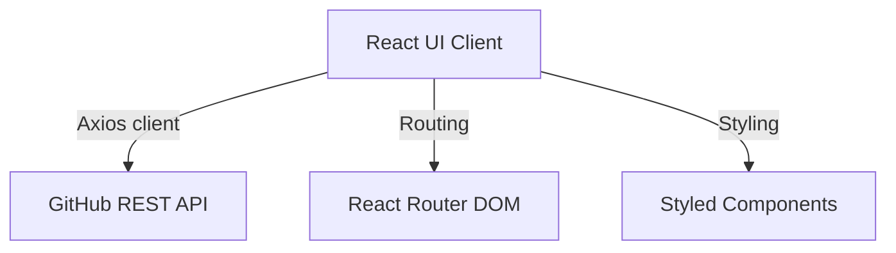

# Git Repos

[](https://reactjs.org/)
[](https://docs.github.com/en/rest)

## Table of Contents

- [Context](#-context)
- [Software features](#-software-features)
- [Technologies and tools](#-technologies-and-tools)
- [Architecture](#-architecture)
- [Repository structure](#-repository-structure)
- [Requirements](#-requirements)
- [How to run](#-how-to-run)
- [Author](#-author)

# 📌 Context 

This is a simple React web application designed to search for GitHub repositories and display their open and closed issues. The primary focus of this project is practicing API consumption (GitHub REST API), routing, and creating a user-friendly frontend interface.

## 🚀 Software features

- **Repository Search:** Search and add public GitHub repositories to a localized dashboard list.
- **Detailed View:** Redirects to a dedicated repository details page.
- **Issues Tracker:** Fetches and displays open/closed issues of a selected repository, complete with pagination.
- **Data Persistence:** Keeps the search list saved locally in the browser's `localStorage`.

## 🛠️ Technologies and tools

- JavaScript (ES6+)
- React (UI Component Library)
- Axios (HTTP requests client)
- React Router DOM (Navigation and routing)
- Styled Components (Modular CSS styling)

## 📋 Architecture



## 📂 Repository structure

```text
- 📂 web-git-repos/
  - 📄 package.json (Project configurations and scripts)
  - 📂 public/ (Static frontend hosting files)
    - 📄 index.html
  - 📂 src/ (React application sources)
    - 📄 App.js (Global application wrapper)
    - 📄 index.js (React render root entrypoint)
    - 📄 routes.js (Router setups for application pages)
    - 📂 pages/ (Application views)
      - 📂 Main/ (Dashboard search page component)
      - 📂 Repositorio/ (Detailed issues page component)
    - 📂 services/
      - 📄 api.js (Axios base instance pointing to GitHub API)
    - 📂 styles/
      - 📄 global.js (Styled Components global CSS declarations)
```

## 📦 Requirements

- Node.js v18 or higher
- npm or yarn package manager

## ⚙️ How to run

### 1. Clone the Repository
Clone the repository to your local machine:
```bash
git clone https://github.com/MatheusRodri/web-git-repos.git
cd web-git-repos
```

### 2. Install Dependencies
Install all the project packages using npm:
```bash
npm install
```

### 3. Run the Application
Start the development server:
```bash
npm start
```
Open `http://localhost:3000` in your web browser to view the application.

## 👤 Author

Matheus Rodrigues 
[LinkedIn](https://linkedin.com/in/matheus-rodrigues-mrj) [GitHub](https://github.com/MatheusRodri)